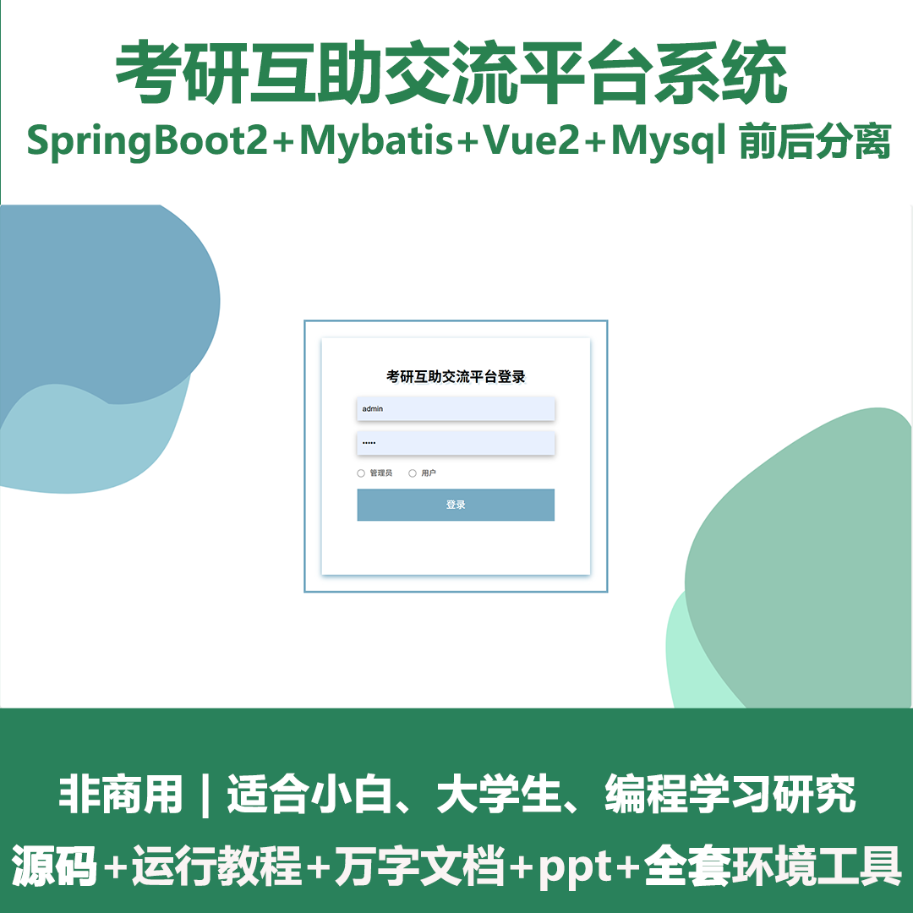
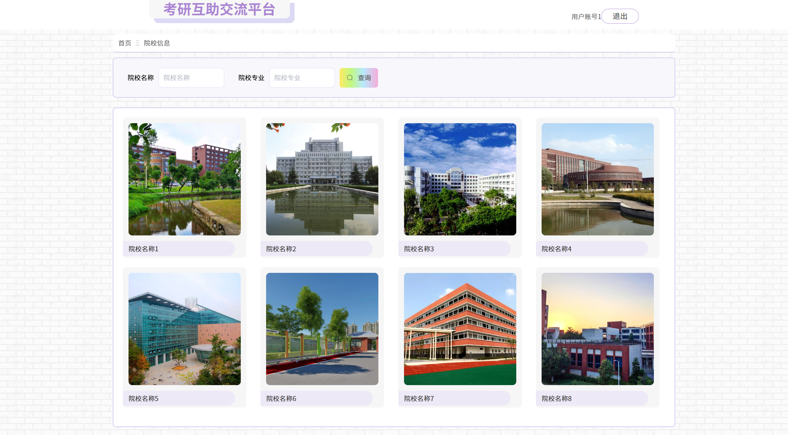
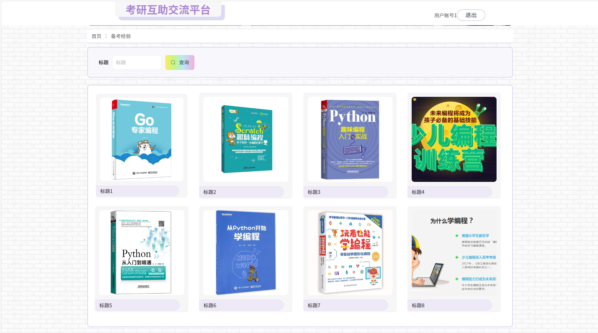
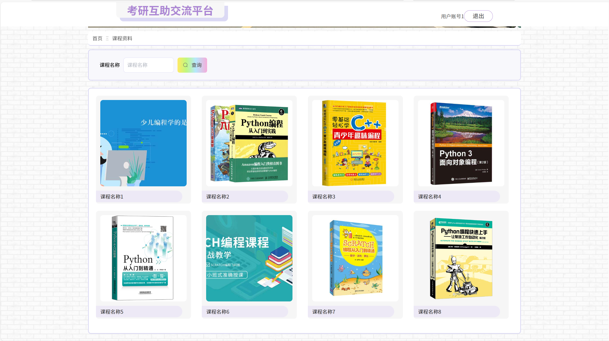
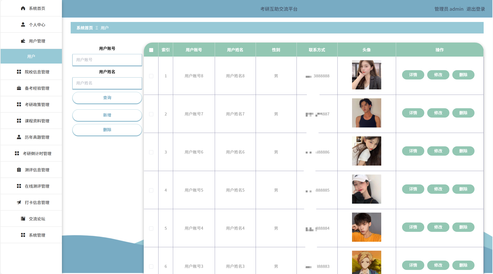
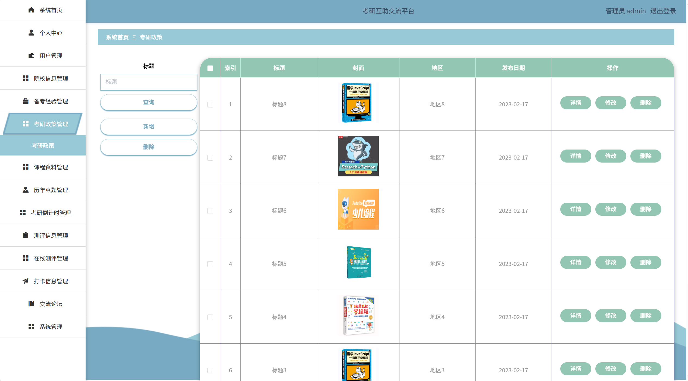
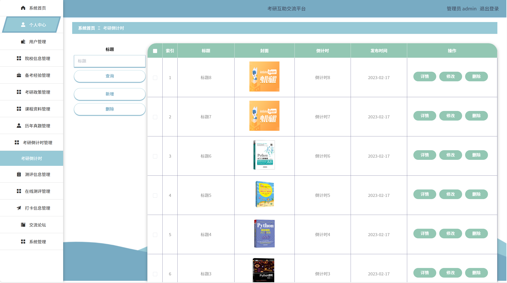
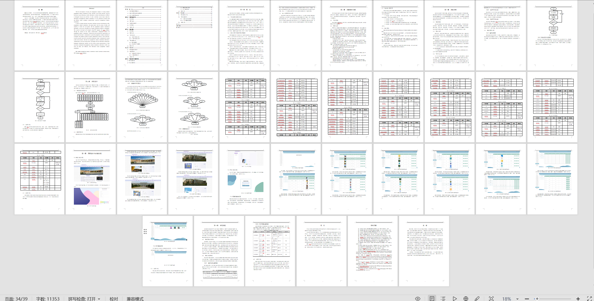

# springbootA402
springbootA402考研互助交流平台+LW
 
## 查看主页获取源码

### 一、关键词

考研交流平台，考研互助社区，考研互助社区

 

### 二、作品包含

源码+数据库+设计文档万字+PPT+全套环境和工具资源+部署教程

 

### 三、项目技术

前端技术：Html、Css、Js、Vue2.0、Element-ui 
后端技术：Java、SpringBoot2.0、MyBatis

  
 

### 四、运行环境（以下版本亲测，其他版本未知，请自测）

开发工具：IDEA/eclipse  + vscode

数据库：MySQL5.7（最低要5.7版本）

数据库管理工具：Navicat10以上版本

环境配置软件： JDK1.8 + Maven3.6.3

前端Nodejs：14

浏览器：谷歌浏览器

 

### 五、项目介绍

项目编号：springbootA402

 为设计一个安全便捷，并且使用户更好获取本考研信息，本文主要有安全、简洁为理念，实现用户快捷寻找考研信息，从而解决考研信息复杂难辨的问题。该系统采用PHP语言和mysql数据库进行开发设计，通过对考研互助交流管理流程的分析，分析了其功能性和非功能性需求，设计了考研互助交流系统，该平台包括管理员和用户两部分。同时还能为用户提供一个方便实用的考研互助交流系统，使得用户能够及时地找到合适自己的考研信息。管理员在使用本系统时，可以通过后台管理员界面管理用户的信息，也可以发布系统公告，让用户及时了解考研信息。这样，用户就可以安全高效地找到考研信息。

  
 
### 六、运行截图

  
